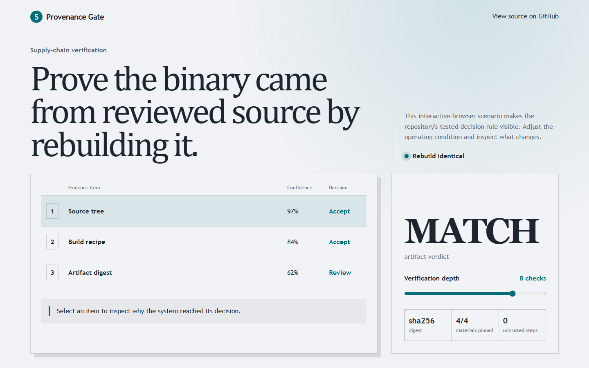
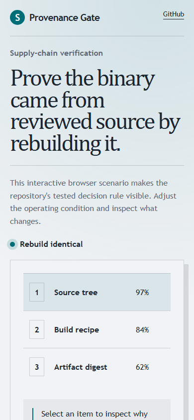

# provenance-gate

> A SLSA provenance verifier that proves a binary came from the reviewed source - by rebuilding it, not by trusting the attestation.

## Live deployment

[](https://github.com/SlateGitOrg/provenance-gate/actions/workflows/ci.yml)

[Open the interactive Provenance Gate demo](https://slategitorg.github.io/provenance-gate/)

The deployed interface uses a deterministic offline scenario to make the repository's tested decision rule visible without external services or private data.

### Desktop



### Mobile



`FLAGSHIP` · **Cybersecurity** · Expert · ~5-6 weeks · Manufacturing - firmware and embedded build pipelines

**Primary language:** Go
**Tags:** `supply-chain`, `slsa`, `in-toto`, `sigstore`, `reproducible-builds`, `policy-as-code`

---

> **Implementation note.** The catalogue specifies **Go** for this
> project and that remains the target. This repository ships a runnable
> **Python** reference implementation of the core differentiator so the
> behaviour is executable and tested today; port it to Go as step one
> of your own build.

## The problem

SBOM adoption told organisations *what* is in a build, but not whether the build itself is trustworthy. An attacker who compromises a CI runner produces an artifact with a perfectly accurate SBOM. Regulated manufacturers now have to prove the binary they ship is the one the reviewed source produced - and 'we scan our dependencies' does not answer that question.

## ⭐ The differentiator

Verifies **in-toto/SLSA provenance attestations against a policy** - builder identity, source commit, isolation level - and then performs a **rebuild-and-diff to prove reproducibility**, rather than trusting the attestation's own claims. A generic supply-chain project scans for vulnerable dependencies and calls it supply-chain security. This one answers 'did the artifact actually come from this source, on this builder', which is precisely the question a compromised-runner attack defeats.

This is the sentence to lead with when someone asks you to walk through the
project. Everything else in this repo exists to make it true and to prove it.

## Data

Public SLSA provenance examples plus a self-hosted local build lab (Docker + local Sigstore/Rekor in offline mode) producing signed attestations. **Planted tampered attestations** with documented tamper types give the verifier a definite pass/fail rather than a plausible-looking demo.

> No paid API key is required to run or demo this project. Where a paid
> service would add value it is wired as an optional enhancement behind an
> interface with an offline mock as the default implementation.

## Stack

- Go
- in-toto / SLSA verification libraries
- Sigstore (offline trust root; no hosted dependency required)
- Local OCI registry (Zot)
- Open Policy Agent / Rego for the policy layer
- Docker, GitHub Actions

## Core capabilities

- Attestation signature and certificate-chain verification against an offline trust root
- Rego policy engine over builder identity, source repository, entry point and SLSA level
- Reproducible-rebuild harness with a normalised binary diff that explains any mismatch
- Admission-gate mode rejecting unverified artifacts at deploy time
- Provenance graph for multi-stage builds, showing transitive builder trust

## Repository layout

```
cmd/gate/
internal/attest/
internal/policy/
internal/rebuild/
policy/                   # Rego, reviewed like code
lab/                      # local build estate + tamper injection
test/
docs/
```

## Build plan

1. Stand up the local build lab and produce one genuine signed attestation. Everything downstream needs it.
2. Verification + policy next. Enumerate the tamper types before writing the verifier - they are your spec.
3. Rebuild-and-diff last; normalising away benign nondeterminism (timestamps, paths) is the hard, interesting part.
4. Write docs/threat-model.md as you go, not at the end.

## Testing strategy

Each documented tamper type - swapped digest, forged builder identity, replayed attestation, altered source ref, downgraded SLSA level, expired certificate, unsigned attestation - must be **rejected with the correct error class**, not merely rejected. Reproducible builds must diff to zero after normalisation, and a deliberately non-reproducible build must be reported as such rather than passed.

Tests assert **correctness**, not merely that the code runs. A green suite on
this repo is a claim about behaviour under adversarial conditions; treat any
test that would pass against a deliberately broken implementation as a bug in
the test.

## Quality & safety layer

A documented threat model in docs/threat-model.md covering compromised runner, compromised registry, key theft and rollback - with an explicit statement of what the gate does *not* defend against.

## Measurable outcome

> No artifact reaches the registry without a verified source-to-binary chain; all seven planted tamper classes are rejected with a specific, actionable reason.

State it in these terms — business units, not technical ones — in your CV
bullet and in the first thirty seconds of describing the project.

## Interview questions this project answers

- **What does an SBOM actually prove, and what does it not?**
- **How would you detect a compromised CI runner?**
- **What makes a build reproducible, and what usually breaks it?**

## What this deliberately is *not*

- Not an SBOM generator. Plenty exist; the gap is verification.
- Not offensive tooling. Every tamper case is generated locally against your own artifacts.


## Run it now

```bash
python -m unittest discover -s tests -v   # the suite
python -m src.demo                        # the 60-second artefact
```

Requires Python 3.11+. The runnable core uses **only the standard
library** (including `sqlite3`), so there is nothing to install.

## Getting started

```bash
git clone <your-fork-url> provenance-gate
cd provenance-gate
make lab-up                   # local registry + offline Sigstore
make build-signed             # produce a genuine attestation
go run ./cmd/gate verify --artifact ./out/fw.bin --policy policy/
make test-tamper              # all 7 tamper classes must be rejected
```

Docker is supported but optional — every path above works on a plain
Windows/macOS/Linux laptop without a cloud account.

## Definition of done

- [ ] The differentiator above is implemented, and a test proves it
- [ ] The measurable outcome is produced by a command anyone can run
- [ ] `README` explains the one decision a generic version gets wrong
- [ ] CI runs the full suite on every push and is green on `main`
- [ ] A recruiter can see the headline artefact in under 60 seconds

## Licence

MIT — see [LICENSE](LICENSE).
